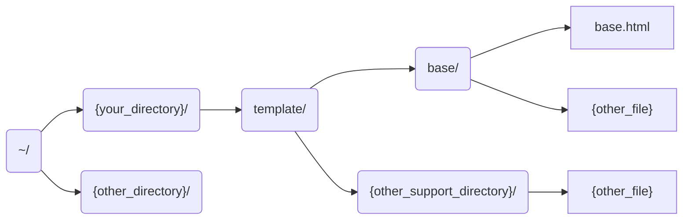

# Documentation: GAPP_Main02

This is the documentation for deepomics pipeline Main02 (version: -06.2004), written by Alex J. K. XU on April 19, 2022.  

[TOC]

## Overall

This pipeline was mainly based on the previous `AutoRunShell` shell script, which was first written by Mr. Jiakai XU and Mr. Xun ZHANG from the GAPP development team to automate the entire bio-analysis process together with the final report generation function. It was initially debugged on the delta2 server, but after time and several analysis proved its accuracy and usability, we adapted it to the deepomics.org website for official use.  

This whole pipeline consists of several modules which can also be found on the same platform that all developed by us. For some important parts, I will cover them later in this documentation.

## Development Team

@author	Mr. Jiakai XU			  	jiakai.xu@my.cityu.edu.hk		

Responsible for the overall design, coding and debugging of the whole shell. Initially build overall pipeline, proposed and implemented the new idea of using transfered JSON file for task submission. Participate in debugging of biological analysis module and adaptation of new generation exps program.

@author	Mr. Xun ZHANG			xzhang2487-c@my.cityu.edu.hk		

Responsible for assisting debugging the whole program, mainly responsible for finding and confirming the correct path of all required files and resources, as well as the design of related folder structure. Responsible for several python-related sections. Participate in the adaptation of new generation exps program.

@author 	Miss Yuqin HUANG		yqhuang23-c@my.cityu.edu.hk	

Responsible for the adaptation and debugging of the new infres program, and is now developing the next generation of report template files used in exps.

@author	Miss Shiying LI				shiyingli7-c@my.cityu.edu.hk	

Act as project supervisor to oversee the whole project. Provided the initial `generate_script` script and made many professional technical suggestions on the biological analysis process.	

## Version Information

- -deepomics : Online deepomics platform used only. We considered the relative resource location and file access permission inside the deepomics docker.
- -pipeline: For deepomics pipeline used only. Because Pipeline and Module have different file hierarchies at run time, all modules covered in this article may not be called individually by the Module itself.
- -timing : Running time will be compute and displayed in a human readable way.
- -error : We redirected the stderr stream to the same as stdout stream to make running log more easy to read on the deepomics website.
- version : 06.2004+
- since : March, 2022

## Programming Language

- Shell Script
- Java
- Python
- JSON

## Overall flow chart


## Before using this pipeline

### Environment

**CentOS Linux Operating System**

The program has been tested on two different platforms with CentOS Linux release 7.9.2009. Due to mission requirements, we won't be doing any testing on MAC or Windows.

### Input

This version of the pipeline requires a json format file as input, the input parameter should point to the absolute path to that json file, such as `/ data/input_transmit/example_key.json`. 

The following is an example format of json:

```json
{
  "uid": 0,
  "fid": "xxx",
  "key": "uxxfxxxx",
  "credentials": "xxxxxxxxxxxxxxxx 64-bits xxxxxxxxxxxxxx",
  "app": {
    "id": "xxx",
    "name": "xxx",
    "report": true,
    "panel": true,
    "template": "Not_In_File",
    "operator": "Not_In_File"
  },
  "user": {
    "id": 0,
    "name": "xxx",
    "gender": "Not_In_File",
    "age": "Not_In_File",
    "birth": "Not_In_File",
    "tel": "Not_In_File",
    "email": "xxx"
  },
  "analysis": {
    "id": 0,
    "name": "xxx",
    "isPiepline": true
  }
}
```

For privacy reasons, I have replaced the value in the actual JSON file above. We assume that the root of JSON is `json`, so I will use `json.key.value` to access the value like `uxxfxxxx`. `Not_In_File` indicates that the value is not supported by GAPP website side and can be expanded in the future.

### Prerequisites

Your genetic data files are stored in `.fq.gz` format and are already located in the server directory we specified. Assuming your user ID is "user_id" and the file name provided is "file_name", then your data files should be located separately on our dl380a server at,

```shell
"/ENCRYPTED_PATH/user${user_id}/data/${file_name}_1.fq.gz"
"/ENCRYPTED_PATH/user${user_id}/data/${file_name}_2.fq.gz"
"/ENCRYPTED_PATH/user${user_id}/data/${file_name}_panel.txt"
```

For security reasons, please contact the project leader manually for the address, or you can change the source code to be the one used in your project.

## Work-flow

### GAPP_Core: Bio-analysis process

#### Preparation

```shell
user_path="./user$user_id"
mkdir "$user_path"
mkdir "$user_path/code"
mkdir "$user_path/data"

cp "/ENCRYPTED_PATH/user$user_id/data/${file_name}_1.fq.gz" "$user_path/data"
cp "/ENCRYPTED_PATH/user$user_id/data/${file_name}_2.fq.gz" "$user_path/data"
```

Under your current workspace, we will first create the required folders, namely ./user/code and ./user/data. and then, as required, as a precondition, your genome files in both directions have been located in the designated places we required on the server (for security reasons, please contact the project leader manually for the address). We will go to the designated place to find and copy your files to our working directory.  

Then, their is an important variable that you need to pay special attention to is the `rootdir` and `shellroot`. The former is used to tell our program the location of some necessary helper programs, such as the generate_scripts.sh that will be mentioned later, which is usually the relative address on deepomics system from the current task's directory to the module's static directory.  The latter specifies the location of the dynamic codes. This is passed to generate_scripts.sh that will be mentioned later to generate code segments to the specified location, and it is also used to tell subsequent runtime addresses.

#### Module inputs

- input files 
  - None
- parameters
  - -i: `json.uid.value`
  - -f: `json.fid.value`

#### Generate scripts

Our AutoRunShell will invoke the `generate_script.sh` to perform the detailed work.    

This helper script only ask for two parameter inputs:   `-l user_path` and `-n user_name`, for which the user path is something like `"./userXYZ"` while the file name is just a simple name like `R` or `NR` in our default folder.

This script will use one of its parent function called `AutoRunShell#fsizeJudge()` to judge the file size of those genetic files to be tested.  If the file size is good enough, we will promote to you `"AutoRunShell >> fsizeJudge >> GOOD DATA SIZE: Your filesize is greater than threshold. Go ahead and have a good day!"`. On the other hand, if the file size is smaller than the threshold we set, our shell will warning that `"AutoRunShell >> fsizeJudge >> SMALL DATA WARN: Your filesize is xxx, which is smaller than the threshold. Error may occur during the analysing process, consider disabling the filtering function!"`

**Special Debug Note**: Previously Miss Shiying LI suggested to disable a01-filterfq process if the small size input file is detected, but we had tried that directly disable is not applicable because some afterwards processes are depend on the output result of the first process. *TODO*: Maybe set some filter parameter to make it pass more easilly is a better choice than directly disable it.

**However**, due to hierarchical relationships between processes, the child process is difficult to pass variables back to its parent process. We did make it come true using `mkfifo` or called "named pipe" on local delta2 server, but deepomics docker does not seems to support this operation. *TODO*: According to Ms L.J. CHE, the docker should be able to support multi-thread operating, so create child-thread may solve the variable not readable issue exists on child-process programming.

After all the work finished, a series of ready to run shell scripts will be generated into the folder of `$user_path/code/` directory, they are `a01-filterfq.sh`, `a02-mem.sh`, `a03-rmclean.sh`, `a04-sort.sh`, `a05-rmfixmate.sh`, `a06-markdup.sh`, `a07-bamindex.sh`, `a08-rmsort.sh`, `a09-realignercreator.sh`, `a10-realn.sh`, `a11-baserecal.sh`, `a12-printreads.sh`, `a13-hc.sh`, `a14-rmbaserecal.sh`, `a15-rmrealn.sh`, `a16-concat.sh`, `a17-vqsrsnp.sh`, `a18-applysnp.sh`, `a19-vqsrindel.sh`, `a20-applyindel.sh`, `a21-annovar-vcf.sh` the detailed bioanalysis information can be found at [Reference#GATK](##reference).

#### Detailed analysis process

For all the 21 generated scripts listed above, we will run them sequentially.    

However, noticed that running GATK process and tools with a wrong version may cause sever unexpected exceptions. In our program, we called a well-designed global function `AutoRunShell#loadAll()`  (shown below) to make sure all the required module are in the correct version.

```shell
loadAll () {
    echo "AutoRunShell >> Load all is now be called!" 
    module load gatk/3.8-0-java-1.8.0_144
    module load annovar/2019oct24-perl-5.30.2
}
```

**Special Debug Note**: In our experience, `a13-hc` and `a17-vqsrsnp` are two places that are often prone to failure. For the "Bad input: Values for ReadPosRankSum annotation not detected for ANY training variant in the input callset. VariantAnnotator may be used to add these annotation ERROR of `a17-vqsrsnp`, 

- We tried to delete the -an option (such as `-an ReadPosRankSum`) reported in error message and let it skip the analysis module, which was really helpful when experimenting with small dataset. However, when we changed to formal large gene data analysis after successful development, even if the deleted parameters were added back, there would be no problem. To sum up, deleting an option can solve some problems temporally, but the real cause of this problem is the size of data is too small. 
- In the above debug process, according to Ms Shiying LI's instructions, we also spent a lot of time trying to solve the problem if we reduce the subsequent `-tranche` value sequence. However, when we reduced the original 100.0-99.9-... to 60.0-55.0 -... It still won't get any better. Perhaps this is not as convenient as following the above mentioned solution.

#### Special Note

Deepomics' default memory allocation is not nearly enough to complete the entire bioanalysis process! The maximum memory limit of 8000MB caused a fatal error in the analysis process at the second step, but the error didn't show up until the last 10 steps, which was a serious hindrance to our debugging. Therefore, our team recommends that you set your maximum memory allocation limit to **<u>20480MB (20GB)</u>**, which will be sufficient to allow you to complete your entire process.

In addition, given GATK's excellent multi-core concurrency, properly setting up multiple CPU cores will greatly increase your work speed (as long as the server administrator allows, of course, otherwise it will take up too much resources and affect others' work).

If you want to know more about the resource usage of other analysis modules, you can use this link, [Deepomics API test](https://homepage.cs.cityu.edu.hk/jiakaixu2/php/deepomicsRequest.php?start=0&end=1). You need to change 0 to the start ID you want and set 1 to the end ID you want in the URL, which can batch query the resource application amount of all blocks within the range of start~end. Click the corresponding link in that row, and you can also use ALEX's CodeCoreProcessor to view the details of json inside it. Here's an example: [Module 700~730](https://homepage.cs.cityu.edu.hk/jiakaixu2/php/deepomicsRequest.php?start=700&end=730).

------

### GAPP_Linking: Decompress the vcf package

Decompress the `*.vcf.gz` file obtained from the previous core biological analysis to facilitate the use of the following modules.

#### Module inputs

- input files 
  - -i: `GAPP_Core.output.Core_vcf`
- parameters
  - -d: `gzip`

------

### GAPP_Filter: Gene filter with panel file

#### Module inputs

- input files 
  - -p: `GAPP_Linking.output.LOutput`
- parameters
  - -i: `json.uid.value`
  - -f: `json.fid.value`

#### Main program

Our python scripts will access the panel file in text format which is located on the server as mentioned above in the [Prerequisites](##Prerequisites). During traversal, all genes that do not appear in the panel will be dropped to make our analysis meets the real needs of user.

------

Given that we're supposed to have done all the biological analysis by this point, why are we still hesitating? Let's move on to generating the test report. The overall task of the following parts are to translate the VCF files analyzed by the algorithm into a user-friendly PDF or HTML page.

------

### GAPP_Infres: Data preprocessing

"infres" stand for "**Information Reserve System**"

The infres system is a Python program that reads VCF files generated by biological analysis and adjusts and integrates them based on relevant guidelines. 

#### Module inputs

- input files 
  - -v: `GAPP_Filter.output.result_vcf`
- parameters
  - -i: `json.uid.value`
  - -k: `json.key.value`

#### Generate json

Our AutoRunShell will invoke the `generate_json.sh` to perform the detailed work.    

This helper script ask for several parameter inputs:   `-k report_number`, `-v vcf_location`, `-i identifier_id`. This program will generate the required JSON file for infres to facilitate their reading and operation, and the specific file format is set up in this code by ourselves, and it is unable to dynamically adjust its format, specific reasons will be discussed in the "Special Debug Note" part later.

As for the JSON file for infres, it is quite simple like the following (reformatted by Alex's CodeCoreProcessor),

```json
{
    "analysis": "annotate_variant_vcf",
    "intermediate_path": "./temp123.csv",
    "samples": [
        {
            "id": 1,
            "vcf_file": "./test/data.anno.hg38_multianno.vcf"
        }
    ]
}
```

**Special Debug Note**: In the beginning, we do hope to maintain a concise and normative template layout, so in the first version, we use a unified template JSON file, and used [`sed -i`](##reference) command to replace the key points inside the template to make a new target file. It works really well if we just need to provide the user information and some time stamp. However, when we come to the directory input, namely those intermediate_path or the vcf_location, we meet a trouble,  sed command use "/" as its internal key separator to locate the matching point and the targeted new segment, where the "/" is also must character inside our directory string, we did try to use escape character, but it does not work well.

#### Main program

This program was previously developed by other seniors, but due to its relatively messy design and strong dependence on the PostgreSQL database, we were required to re-develop it in this project. Miss Yuqin HUANG in our project team bravely assumed the responsibility and undertook all the development work of this part alone. We would also like to thank Mr. Xuedong WANG and Mr. Zicheng ZHAO for their help in dealing with some difficulties.

Since we have develop and install this python program under a Python 3.8 environment, a temporary module change will be needed before infres core process using the command,

```shell
module load python/3.8.2
```

And the core invoking command is like,

```shell
infres process -i JSON_LOCATION
```

------

### GAPP_Exps: Report Generation Process

"exps" stand for "**Express System**"

Exps is a Python program that reads CSV files that have been processed by Infres, looking up the relative gene' and disorders' datafile, generates HTML web pages based on a given template, and saves them into a portable PDF format. 

#### Module inputs

- input files 
  - -p: `GAPP_Infres.output.result_csv`
  - -o: The `*.op` operator file, this input port is already tested successfully on the module itself, but in this pipeline we only use its default version (without external operator file) because the GAPP website still cannot support uploading and storing the operator file.
  - -h: The `*.tar.gz` html template package, this input port is already tested successfully on the module itself, but in this pipeline we only use its default version (without external template package) because the GAPP website still cannot support uploading and storing the template package.
- parameters
  - -i: `json.uid.value`
  - -k: `json.key.value`
  - -n: `json.user.name.value`
  - -g: `json.user.gender.value`

#### About template package

You should have a folder structure like the following:



You can set all the text in { }, but the rest of the file names must be the same. Because we would point the key pointer to: `EXPS_INTERNAL_PATH/template/base/base.html`. So you just need to keep the path of this file unchanged, the rest of the included file path you are free to set.

If you are confused about how to pack your folders, here is a tip you can use on Linux or MacOS:

```bash
cd ~/${your_directory}/
tar -zcvf ${your_filename}.tar.gz template/
```

#### Pruning

In order to prevent some excessively long strings from seriously interfering with the overall aesthetics of the final report, Our Mr. Xun ZHANG designed a pruning program in python, which is used to trim specific variables according to some indicators.

#### Generate json

Our AutoRunShell will invoke the `generate_json.sh` to perform the detailed work.    

This helper script ask for several parameter inputs:   `-k report_number`, `-p intermediate_path`, `-n identifier_name`, `-i identifier_id` and `-g identifier_gender`, although it seems the parameters are relative too complex to memorize clearly, it is because we need to display all the user own information onto the report, for which we have no way to create by ourselves, fortunately, all the meanings of those input parameters can be found inside the [Input Json](##input).

While the JSON file for exps is a little bit complicated compared with the Infres one, since it contians so many user information that needs to pass. A sample JSON is like the following (reformatted by Alex's CodeCoreProcessor),

```json
{
    "product_name": "child genetic test",
    "operator": "./report/operators/rare_disease_operator.op",
    "template_path": "rare_disease_CHN/base/base.html",
    "template_loader_path": "./report/templates",
    "intermediate_path": "./temp123.csv",
    "analysis": "annotate_variant_vcf",
    "output_path_html": "./output/child/html/202100001.html",
    "output_path_pdf": "../output/202100001.pdf",
    "report_num": "202100001",
    "phone_num": "",
    "referring_docter": "",
    "report_time": "2021-11-18",
    "language": "CHN",
    "sample_infos": [
        {
            "identifier_name": "Zhang_Sam",
            "identifier_id": 1,
            "identifier_gender": "male",
            "identifier_birthday": "",
            "identifier_region": "",
            "sample_type": "",
            "sample_receive_ensure_time": "",
            "sample_receive_time": ""
        }
    ]
}
```

#### Main program

This program was previously developed by other seniors, but due to its relatively messy design and strong dependence on the PostgreSQL database, we were required to re-develop it in this project. Mr. Xun ZHANG and Mr. Jiakai XU in our project team undertook this part of the development work. We would also like to thank Mr. Bowen TAN and Mr. Xuedong WANG for their great help in dealing with some difficulties.

Since we have develop and install this python program under a Python 3.8 environment, a temporary module change will be needed before exps core process using the command,

```shell
module load python/3.8.2
```

At the same time, a file copy using `cp` is also needed to move the intermediate csv file from infres working space to exps working space.

And the core invoking command is like,

```shell
exps -i JSON_LOCATION -c INI_LOCATION
```

------

### GAPP_Linking: Unified output path

We will use this module several more times to unify the location of the output files. As for how to access these files from GAPP, please consult Mr. Xun ZHANG, because obviously how to use and call these analysis results is not something that needs to be considered in this analysis pipeline.

#### Module inputs

- First run
  - input files 
  	- -i: `GAPP_Filter.output.result_vcf`
  - parameters
  	- -d: `cp`
- Second run
  - input files 
    - -i: `GAPP_Exps.output.result_pdf`

  - parameters
    - -d: `cp`


#### Module outputs

After the above operations, we successfully copied the `*.vcf` file obtained from the biological analysis and the final generated `*.pdf` report as the final outputs.

### Ending

This is the end of the whole pipeline, and if all goes well, you will find the final detection report generated in the task workspace environment in the corresponding location, such as in the output folder. In future commercial applications, if some files are confirmed to be no longer needed, we can conduct unified storage and sorting here to make the server friendly.

## In the end

Finally, this is all about our main analysis process, GAPP_Main02 Pipeline. It's time to say goodbye to you, thank you for reading our development documentation, and we the GAPP development team would like to wish you all the best in your work! If you have any questions, please ask our corresponding developers according to the specific types of problems. We will try our best to help you solve the problems and improve our products together. Thank you very much!

Jiakai XU
On behalf of the GAPP development team
April 19, 2022

## Reference

[GAPP <https://gapp.deepomics.org>](https://gapp.deepomics.org/)

[Deepomics <https://deepomics.org>](https://deepomics.org/)

[GATK <https://gatk.broadinstitute.org/hc/en-us>](https://gatk.broadinstitute.org/hc/en-us)

[Linux sed <https://www.gnu.org/software/sed/manual/sed.htm>](https://www.gnu.org/software/sed/manual/sed.htm)

